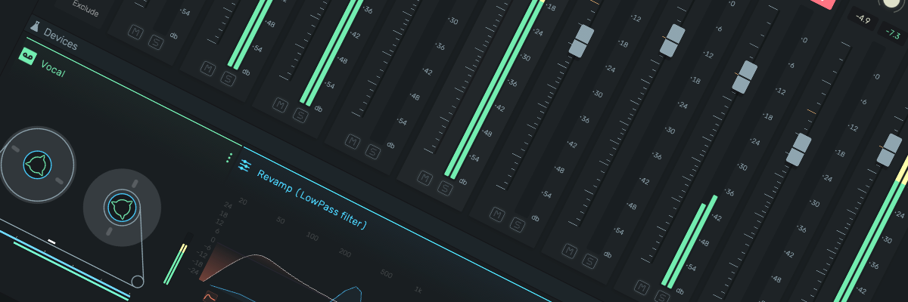

# openDAW

**openDAW** is a next-generation web-based Digital Audio Workstation (DAW) designed to **democratize** music production
and to **resurface the process of making music** by making **high-quality** creation tools accessible to everyone, with
a strong focus on **education** and hands-on **learning**.

## Open-Source

We are committed to transparency and community-driven development. 

The source code for openDAW is available under GPL3 (links below).

## Huge Shoutout To The Incredible openDAW Community!

To everyone who has contributed feedback, reported bugs, suggested improvements, or helped spread the word — thank you!
Your support is shaping openDAW into something truly powerful!

Thank
you [@ccswdavidson](https://github.com/ccswdavidson), [@Chaosmeister](https://github.com/Chaosmeister), [@jeffreylouden](https://github.com/jeffreylouden), [@solsos](https://github.com/solsos), [@TheRealSyler](https://github.com/TheRealSyler), [@Trinitou](https://github.com/Trinitou),
and [@xnstad](https://github.com/xnstad) for testing the repositories and identifying issues during the installation of
openDAW!

Special shout-out to the biggest bug hunters: [kanaris](https://kanaris.net/)
and [BeatMax Prediction](https://linktr.ee/beatmax_prediction). Your relentless attention to detail made a huge
difference!

Huge thanks to our [ambassadors](https://opendaw.org/ambassadors), whose dedication and outreach amplify our mission!

**Let’s keep building together!**

### Repositories

* [openDAW](https://github.com/andremichelle/opendaw)
* [openDAW · studio](https://github.com/andremichelle/opendaw-studio)
* [openDAW · library (submodule)](https://github.com/andremichelle/opendaw-lib)

For more information about our mission and goals, please join our [Discord](https://discord.opendaw.studio), visit
our [official website](https://opendaw.org) and test our current [prototype](https://opendaw.studio/). Please consider
supporting this project on [Patreon](https://www.patreon.com/join/openDAW) or [ko-fi](https://ko-fi.com/opendaw).

Watch Polarity's Video *"there's a new FREE DAW in town"*

## Get Involved

We welcome contributions from developers, musicians, educators, and enthusiasts. To learn more about how you can
participate, visit our [Contribute](https://opendaw.org/contribute) page.

## Links

* [opendaw.studio (prototype)](https://opendaw.studio)
* [opendaw.org (website)](https://opendaw.org)
* [openDAW on Discord](https://discord.opendaw.studio)
* [openDAW on Patreon](https://www.patreon.com/join/openDAW)
* [openDAW on ko-fi](https://ko-fi.com/opendaw)
* [LinkedIn](https://www.linkedin.com/company/opendaw-org/)
* [Instagram](https://www.instagram.com/opendaw.studio)

## Dual-Licensing Model

openDAW is available **under two alternative license terms**:

| Option                    | When to choose it                                                                                              | Obligations                                                                                                                                                                      |
|---------------------------|----------------------------------------------------------------------------------------------------------------|----------------------------------------------------------------------------------------------------------------------------------------------------------------------------------|
| **A. GPL v3 (or later)**  | You are happy for the entire work that includes openDAW to be released under GPL-compatible open-source terms. | – Must distribute complete corresponding source code under GPL. – Must keep copyright & licence notices. – May run openDAW privately in any software, open or closed (§0). |
| **B. Commercial Licence** | You wish to incorporate openDAW into **closed-source** or otherwise licence-incompatible software.             | – Pay the agreed fee. – No copyleft requirement for your own source code. – Other terms as per the signed agreement.                                                       |

> **How to obtain the Commercial License**  
> Email `andre.michelle@opendaw.org` with your company name, product description, and expected distribution volume.

If you redistribute openDAW or a derivative work **without** a commercial license, the GPL v3 terms apply automatically.

## License

[GPL v3](https://www.gnu.org/licenses/gpl-3.0.txt) © 2025 André Michelle
